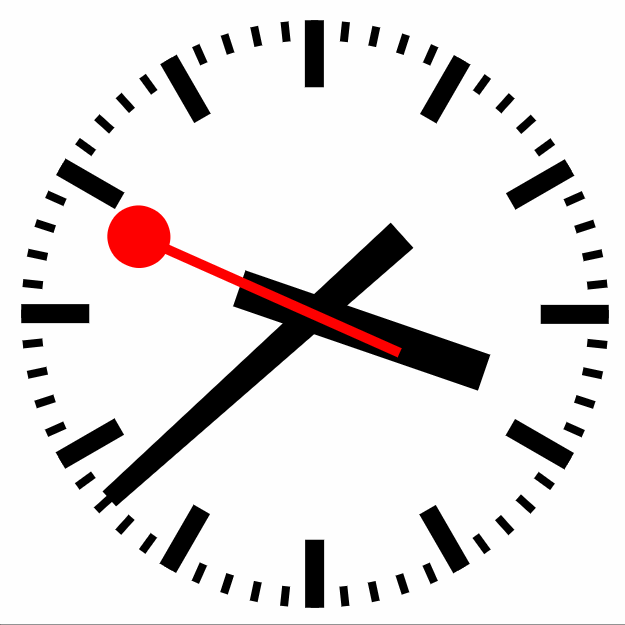

# HTML/CSS/JS analog clock

This is an analog clock built with HTML, CSS and JS. Check it out on [CodePen](https://codepen.io/Mkuehb/pen/QmrWxE).

## Getting started

To get started
* clone the repository
* switch into the directory `cd clock`
* run `npm install` to install the dependencies used for the development (gulp and browser-sync)
* and run `gulp watch`

## Helpful sources:
* [Items on a circle with CSS](https://hugogiraudel.com/2013/04/02/items-on-circle/) by [Hugo Giraudel](https://twitter.com/HugoGiraudel)
* [css-tricks nth-tester](https://css-tricks.com/examples/nth-child-tester/#)
* [CSS transform-origin
](https://developer.mozilla.org/en-US/docs/Web/CSS/transform-origin)
* [JavaScript Date](https://developer.mozilla.org/en-US/docs/Web/JavaScript/Reference/Global_Objects/Date)